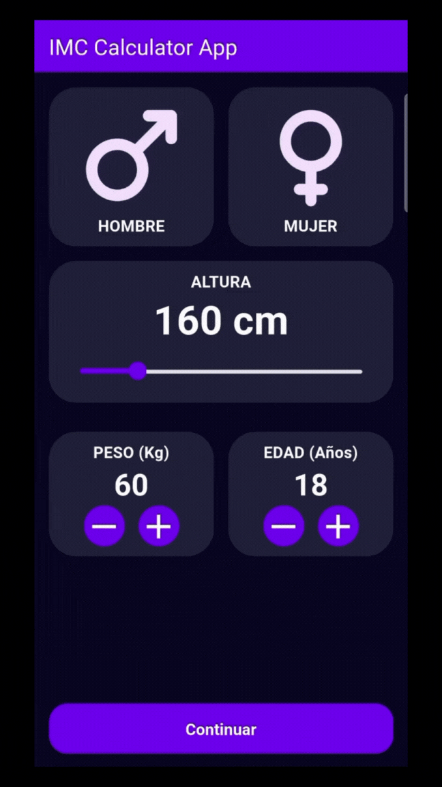

# Body Mass Index (BMI) Calculator App

## Introduction

The development of this application is part of my learning process in Flutter and Dart, tools for cross-platform mobile application development. As a formative project, a Body Mass Index (BMI) calculator app has been designed and built, aimed at allowing users to quickly estimate their nutritional status based on basic data such as weight and height.

This project has been a valuable opportunity to apply various essential concepts of mobile development, including the design of attractive user interfaces, the structuring of reusable components, handling user input, performing calculations, and clearly presenting results.

## Technological Stack

  
  &nbsp;&nbsp;&nbsp;
  

## Application Overview

This application aims to provide users with a quick estimate of their nutritional status by calculating their Body Mass Index (BMI). On the initial screen, users are asked to input data such as gender (male or female), height in centimeters, weight in kilograms, and age in years. Although gender and age are not directly used in the BMI calculation, they were included in the interface as an additional opportunity to practice managing components within the Flutter and Dart development environment.

Once the data is entered, the user can press the "Continuar" button to view their BMI, the corresponding category, and a brief description of that category. The category is presented dynamically, using a color scheme as a representative visual element.

Finally, the user can return to the initial screen by pressing the "Finish" button or using the back navigation arrow.

## Results

  

## Acknowledgments

This application was developed by following the guidance provided by [AristiDevs](https://github.com/ArisGuimera) through his FLUTTER and DART course. I sincerely thank him for the creation of this educational material, which has been instrumental in my learning process and in the successful development of this project.